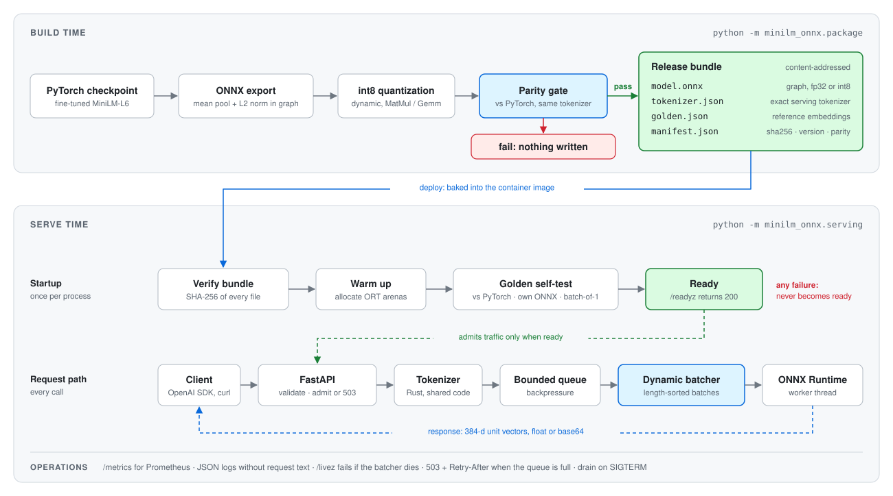
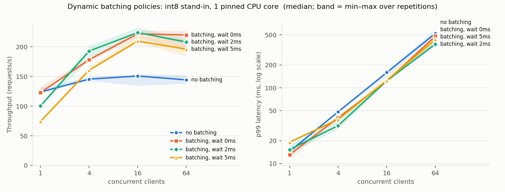

# minilm-onnx-bench

[](https://github.com/yogvidwankhede/minilm-onnx-bench/actions/workflows/ci.yml)

Production serving for my fine-tuned sentence-embedding model
[`yogvidwankhede/healthmate-minilm-l6-v2-medical-3fold`](https://huggingface.co/yogvidwankhede/healthmate-minilm-l6-v2-medical-3fold),
the retriever behind [HealthMate-AI](https://github.com/yogvidwankhede/HealthMate-AI).
It covers the path from PyTorch checkpoint to a running service:

- **Export** to ONNX with pooling and normalization inside the graph.
- **Release gate:** a model bundle is only produced if ONNX Runtime matches PyTorch within tolerance.
- **Bundles** are content-addressed over every file; the server re-verifies checksums at startup
  and runs a golden-vector self-test before taking traffic.
- **Inference service:** OpenAI-compatible API, token-budget dynamic batching, all-or-nothing load
  shedding, request size limits, Prometheus metrics, JSON logs with no request text, a self-healing
  failure model, graceful drain.
- **Container:** no PyTorch in the image, non-root, readiness-based health check.
- **CI:** lint, tests on Python 3.10 and 3.12, the release gate, and an image build plus container
  smoke test.
- **Benchmarks:** offline (ONNX Runtime vs PyTorch) and online (load test of batching policies,
  repeated runs), with the method written down.

<picture>
  <source media="(prefers-color-scheme: dark)" srcset="docs/architecture-dark.svg">
  
</picture>

<sub>Diagram generated by <code>tools/draw_architecture.py</code>.</sub>

## Quick start

```bash
pip install torch --index-url https://download.pytorch.org/whl/cpu
pip install -e ".[dev]"

make test                        # 55 tests, offline, about 15 s
make bundle MODEL=standin        # gated bundle from a same-architecture stand-in (no network)
make bundle                      # gated bundle from the real fine-tuned weights (Hugging Face)
make serve BUNDLE=bundles/<name> # http://localhost:8080
```

```bash
curl -s localhost:8080/v1/embeddings -H 'content-type: application/json' \
  -d '{"input": ["chest pain radiating to the left arm", "metformin side effects"]}'
```

Because the API matches OpenAI's embeddings endpoint, existing clients work unchanged:

```python
from openai import OpenAI

client = OpenAI(base_url="http://localhost:8080/v1", api_key="unused")
vec = client.embeddings.create(model="healthmate-minilm", input="shortness of breath").data[0].embedding
```

Container:

```bash
docker build --build-arg BUNDLE=bundles/<name> -t minilm-embed .
docker run -p 8080:8080 -e EMBED_INTRA_OP_THREADS=2 minilm-embed
```

## Results

All numbers so far come from a **randomly initialized model with the identical architecture**
(6 layers, hidden 384, 22.6M params); the workspace this was built in couldn't download the
fine-tuned weights.

- **What transfers:** offline latency. It depends on architecture and input shapes, not weight
  values.
- **What doesn't:** retrieval fidelity under int8. The release gate checks that on the real weights
  when `make bundle` runs.
- **Partly:** the online load test tokenized with a small stand-in vocabulary trained on the test
  corpus, so its sequence lengths only approximate the real 30,522-token vocabulary's.

Hardware: a 2-vCPU KVM guest with AVX-512 VNNI. The guest reports one thread per core, but the
host's mapping is unknown, so "separate cores" may share a physical core.

### Offline: ONNX Runtime vs PyTorch

| Variant | Size | Speedup vs PyTorch eager (range over 9 batch × sequence cells) |
|---|---:|---|
| ONNX fp32, ORT-fused | 90.2 MB | 1.11x – 2.68x |
| ONNX int8, dynamic quantization | 58.5 MB | 1.96x – 4.73x |

- The biggest fp32 gain is at batch 1 with short inputs, where eager-mode dispatch overhead
  dominates.
- **Unfused** fp32 ONNX was no faster than PyTorch at batch 32 in two cells: 0.93x at seq 128, and
  0.98x at seq 32, whose CI straddles 1.
- int8 is only 35% smaller because the token-embedding table isn't quantized.
- int8 gains lean on the CPU's VNNI support.

Details: [`results/standin/results.md`](results/standin/results.md) · [ADR 0003](docs/adr/0003-int8-dynamic-quantization.md)

### Online: dynamic batching

int8, server pinned to one vCPU, load generator on the other, single-text requests; median of 3
interleaved repetitions, with shaded min–max bands.



| Policy | c=1 p50 | c=16 req/s · p50 | c=64 req/s · p50 |
|---|---:|---:|---:|
| No batching | 7.6 ms | 151 · 104 ms | 144 · 442 ms |
| **Batching, wait 0 ms (default)** | 7.7 ms | 222 · 69 ms | 220 · 279 ms |
| Batching, wait 5 ms | 13.0 ms | 210 · 71 ms | 196 · 321 ms |

Batching raises throughput 47–53% under load and cuts median latency by a third or more, with
non-overlapping ranges across repetitions. It costs nothing when idle as long as it doesn't *wait*:
requests that arrive while the model is busy form the next batch by themselves. Whether a 2 ms wait
beats 0 ms under heavy load is inside the noise; see [ADR 0004](docs/adr/0004-dynamic-batching.md).
Full table: [`results/serving/loadtest.md`](results/serving/loadtest.md).

### Measuring it honestly

The first load test said batching *collapses* at 64 concurrent clients. Before changing any code I
checked where the time went:

1. Pinned server and load generator to separate vCPUs. The collapse remained.
2. Compared a cold server with one that had already run lower load levels. Both collapsed, so it
   wasn't accumulated state.
3. Profiled the server (py-spy). Neither the ORT thread nor the event loop was saturated.
4. Compared server-side request time (from `/metrics`) with client-side latency. They disagreed by
   about 8x.
5. Swapped the load generator's HTTP client.

Same server, same load, only the client changed ([`results/serving/client_comparison.md`](results/serving/client_comparison.md),
median of 2 runs):

| Client, 64 connections | Req/s | Client p99 | Server-side time per request |
|---|---:|---:|---:|
| httpx | 81 | 3,146 ms | 64 ms |
| aiohttp | 194 | 482 ms | 297 ms |

The service was fine. httpx's async connection pool was the bottleneck under bursty responses, which
is exactly the pattern batching produces; at 16 connections both clients agree. The load test now
uses aiohttp, pins CPUs, repeats runs, and reports the server's own view next to the client's, so a
disagreement between them is visible instead of silently wrong. `--client httpx` reproduces the
problem.

## Operating it

- [Runbook](docs/runbook.md): endpoints, configuration, metrics, PromQL alerts, symptoms and actions,
  deploy/rollback, shutdown sequence, capacity planning.
- Architecture decisions:
  [0001 ONNX Runtime on CPU](docs/adr/0001-onnx-runtime-cpu.md) ·
  [0002 gated bundles](docs/adr/0002-gated-model-bundles.md) ·
  [0003 int8 and its batch dependence](docs/adr/0003-int8-dynamic-quantization.md) ·
  [0004 dynamic batching](docs/adr/0004-dynamic-batching.md) ·
  [0005 process model and packaging](docs/adr/0005-process-and-packaging.md)

## What is verified where

| Claim | Verified by |
|---|---|
| Export parity, dynamic shapes, padding invariance | `tests/test_pipeline.py` |
| Gate blocks bad bundles; tampered, mismatched or tokenizer-drifted bundles never become ready | `tests/test_serving.py` |
| Batching preserves order; fp32 is batch-invariant; int8 drift exists and is bounded | `tests/test_serving.py` · `results/serving/batch_drift.json` |
| Load shedding is all-or-nothing; timeouts and cancellations release work; a dead batcher fails fast and turns liveness red | `tests/test_serving.py` |
| API shape, validation, size limits, request-id sanitizing, error shapes, metrics | `tests/test_serving.py` |
| Serving runs with no PyTorch installed | clean-virtualenv run during development; CI `image` job |
| Docker image builds, is non-root, reads its bundle, becomes healthy, serves, drains | CI `image` job (container registries were blocked in the build workspace, so CI is its first build) |
| Real fine-tuned weights pass the gate | **pending**: `make bundle` on a machine with Hugging Face access |

## Layout

```
src/minilm_onnx/
  model.py export.py parity.py      export + parity (build time, needs torch)
  package.py                        gated bundle builder
  bench.py runtimes.py report.py    offline ONNX Runtime vs PyTorch benchmark
  serving/                          runtime, no torch
    bundle.py      manifest, checksums, content-addressed version, golden set
    tokenize.py    Rust tokenizer + padding (shared with the packager)
    engine.py      admission, token-budget batcher, ORT worker, cache, failure handling, drain
    app.py         HTTP API, limits, errors, request ids, metrics endpoint
    config.py metrics.py logs.py __main__.py
tools/            load test, load-test runner, batch-drift measurement, report/chart
docs/             runbook, ADRs
requirements/     pinned serving lock file used by the Dockerfile (Python 3.11+)
```

## License

Apache-2.0 (see [LICENSE](LICENSE)), matching the model.
