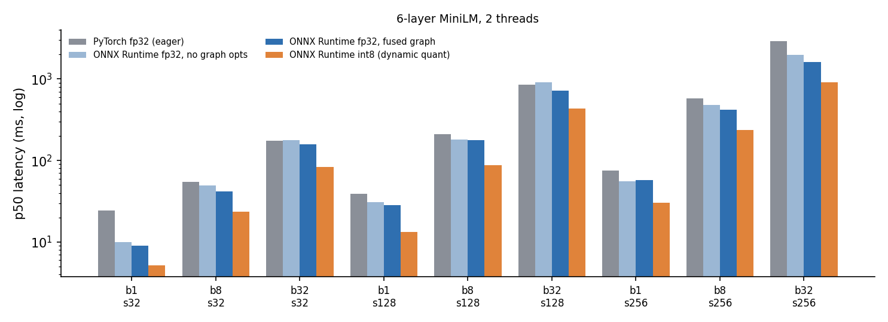

# minilm-onnx-bench

Export my fine-tuned sentence-embedding model
[`yogvidwankhede/healthmate-minilm-l6-v2-medical-3fold`](https://huggingface.co/yogvidwankhede/healthmate-minilm-l6-v2-medical-3fold)
(the retriever from [HealthMate-AI](https://github.com/yogvidwankhede/HealthMate-AI)) to ONNX, prove the export
produces the same embeddings, and measure what ONNX Runtime buys over PyTorch on CPU.

```
PyTorch model ──► ONNX fp32 ──► ORT-fused fp32
                     └────────► int8 (dynamic quantization)
         │
         ├─ parity:  element-wise, per-sentence cosine, retrieval ranking agreement
         └─ bench:   p50/p95/p99 latency + throughput over batch × sequence length,
                     speedup with 95% bootstrap CIs
```

## Quick start

```bash
pip install torch --index-url https://download.pytorch.org/whl/cpu   # CPU wheel
pip install -e ".[dev]"

make test            # 14 offline tests (tiny model, ~10 s)
make bench           # real fine-tuned weights from the Hugging Face Hub
make bench-standin   # same architecture, random weights: speed only, no network
```

Each run writes `results/<name>/results.json` (everything, machine-readable), `results.md` (tables) and
`latency.png`. The command exits non-zero if any ONNX variant fails its parity gate.

## Design decisions

**Pooling and normalization live inside the ONNX graph.** The model's `modules.json` is
Transformer → mean pooling → L2 normalize. Exporting only the encoder would leave every consumer to
reimplement masked mean pooling, which is the easiest place to silently diverge (forgetting the padding mask
changes every embedding). The exported graph takes `input_ids`, `attention_mask`, `token_type_ids` and returns
the final 384-d unit vector.

**Dynamic batch and sequence axes, verified on shapes the trace never saw.** The export traces a (2, 16)
input with one padded row, so masking is traced rather than constant-folded. Tests then check parity at
(1, 5), (3, 40) and (7, 128).

**Parity is gated at three levels.** fp32 variants must match PyTorch to max |Δ| ≤ 1e-4 and cosine ≥ 0.99999.
int8 is lossy by design, so it gets a task-level gate instead: cosine ≥ 0.98 and top-1 retrieval agreement
≥ 0.90 on a 15-query × 40-document set (`src/minilm_onnx/corpus.py`, written for this repo; it checks ranking
stability, it is not a quality benchmark).

**Fair timing.** Same input arrays for every runtime, tokenization excluded, the same thread count for
PyTorch (`torch.set_num_threads`) and ORT (`intra_op_num_threads`), warmup calls, and runtimes interleaved
across rounds within each cell so machine drift hits all of them. Speedup is a ratio of medians with a
percentile-bootstrap 95% CI, so a "1.1x" that overlaps 1.0 reads as no difference.

## Results so far: architecture stand-in, 2 vCPUs

The workspace this was built in could not download the weights, so the committed run uses a **randomly
initialized model with the identical architecture** (6 layers, hidden 384, 12 heads, 22.6M params). Latency
depends on architecture and shapes, not weight values, so the speed numbers transfer; the parity numbers here
only show the export mechanism is exact, not how int8 affects this model's retrieval.
Full tables: [`results/standin/results.md`](results/standin/results.md).



| Variant | Size | Speedup vs PyTorch (range over 9 batch × seq cells) |
|---|---:|---|
| ONNX fp32, no graph opts | 90.3 MB | 0.93x – 2.43x |
| ONNX fp32, ORT-fused graph | 90.2 MB | 1.11x – 2.68x |
| ONNX int8, dynamic quant | 58.5 MB | 1.96x – 4.73x |

What the numbers say, with the caveats a reviewer would raise:

- **The biggest fp32 win is at batch 1, short input (~2.5x)**, where PyTorch eager's per-op Python/dispatch
  overhead dominates. At large batches the work is GEMM-bound and fp32 ONNX gains shrink to ~1.1–1.8x.
  Unfused ONNX was *slower* than PyTorch at batch 32 × seq 128 (0.93x, CI [0.88, 0.96]).
- **int8 roughly halves latency everywhere** (≥1.96x in every cell) with embeddings at cosine ≥ 0.99995 to
  fp32 on the stand-in. Whether retrieval survives quantization on the *fine-tuned* weights is exactly what
  the real run's gate checks.
- **int8 is only 35% smaller, not 75%.** Dynamic quantization targets MatMul/Gemm; the 30,522 × 384 token
  embedding table (~47 MB) stays fp32.
- This is a shared 2-vCPU cloud sandbox, so tails are noisy (see p95 columns). Rerun on the machine you
  actually serve from before quoting numbers.

## Results: fine-tuned weights

_Pending: `make bench` on a machine with Hugging Face access writes `results/healthmate/`._

## Layout

```
src/minilm_onnx/
  model.py      SentenceEmbedder (encoder + mean pool + normalize), loaders, stand-in builder
  export.py     torch.onnx.export, ORT graph fusion, int8 dynamic quantization
  runtimes.py   PyTorch / ORT runners behind one call signature; synthetic batches
  parity.py     element-wise, cosine and retrieval-agreement checks with gates
  bench.py      timing loop, interleaved rounds, bootstrap speedup CIs
  report.py     results.md + latency.png
  cli.py        export → parity → bench → report
tests/          offline tests on a 2-layer model: pooling, padding invariance, dynamic-shape parity,
                int8 tolerance, bootstrap CI, end-to-end report
```

## Not covered (yet)

GPU execution providers, static (calibrated) int8, quantizing the embedding table, and end-to-end latency
including tokenization. Each would be a separate, clearly labelled column rather than a change to these.

## License

Apache-2.0, matching the model.
