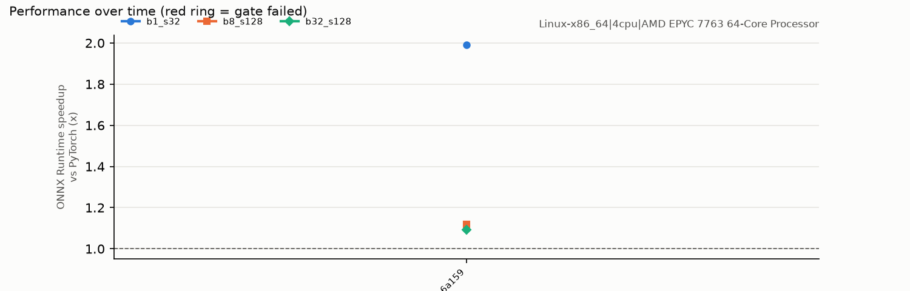

# Performance history

Written by CI on every push to `main` (see `tools/perf_gate.py` on the main branch). Each run times ONNX Runtime and PyTorch on the same runner with the real fine-tuned weights; the gate fails on a sudden drop against the rolling median, a breach of the committed floor, or any fidelity loss.

## Most recent runs

| When (UTC) | Commit | Hardware | b1_s32 speedup · p50 | b8_s128 speedup · p50 | b32_s128 speedup · p50 | Gate |
|---|---|---|---|---|---|---|
| 2026-09-29T23:18:12Z | `5b6a159` | Linux-x86_64|4cpu|AMD EPYC 7763 64-Core Processor | 1.99x · 5.1 ms | 1.12x · 136.9 ms | 1.09x · 559.5 ms | PASS |
